# Entity-Relationship Design

Companion to [`system-architecture.md`](system-architecture.md). This is the authoritative data-model reference; `database/migrations/*` must match it (if they ever diverge, this document is wrong and should be corrected in the same PR that changes the migration).

Conventions used throughout (see `coding-standards.md` for the full rationale):

- All tables: `id` (unsigned bigint PK), `created_at`, `updated_at`; `deleted_at` (soft delete) called out explicitly where used.
- All monetary columns are integer **minor units** (cents) — suffixed `_cents` — never `float`.
- Every table below the tenancy level carries `branch_id`; tenancy-level tables carry `tenant_id`.
- `snake_case` table names, plural; FK columns named `<singular>_id`.

## 1. Tenancy, Branch & Identity

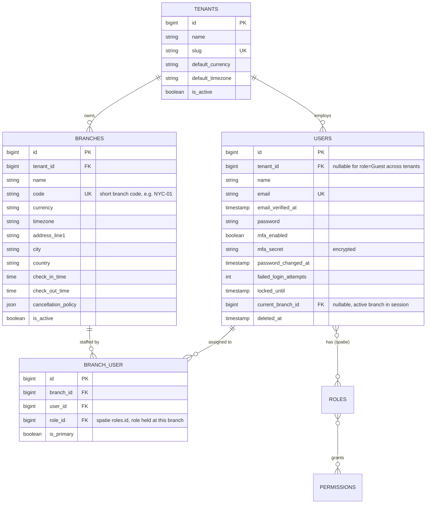

Spatie `laravel-permission`'s own tables (`roles`, `permissions`, `model_has_roles`, `model_has_permissions`, `role_has_permissions`) are used as-is (global roles, per the architecture decision in §3 of the system architecture doc); `BRANCH_USER.role_id` references `roles.id` to record which role a user holds *at a specific branch*, independent of any tenant-wide role also assigned directly on `model_has_roles`.

## 2. Room Management

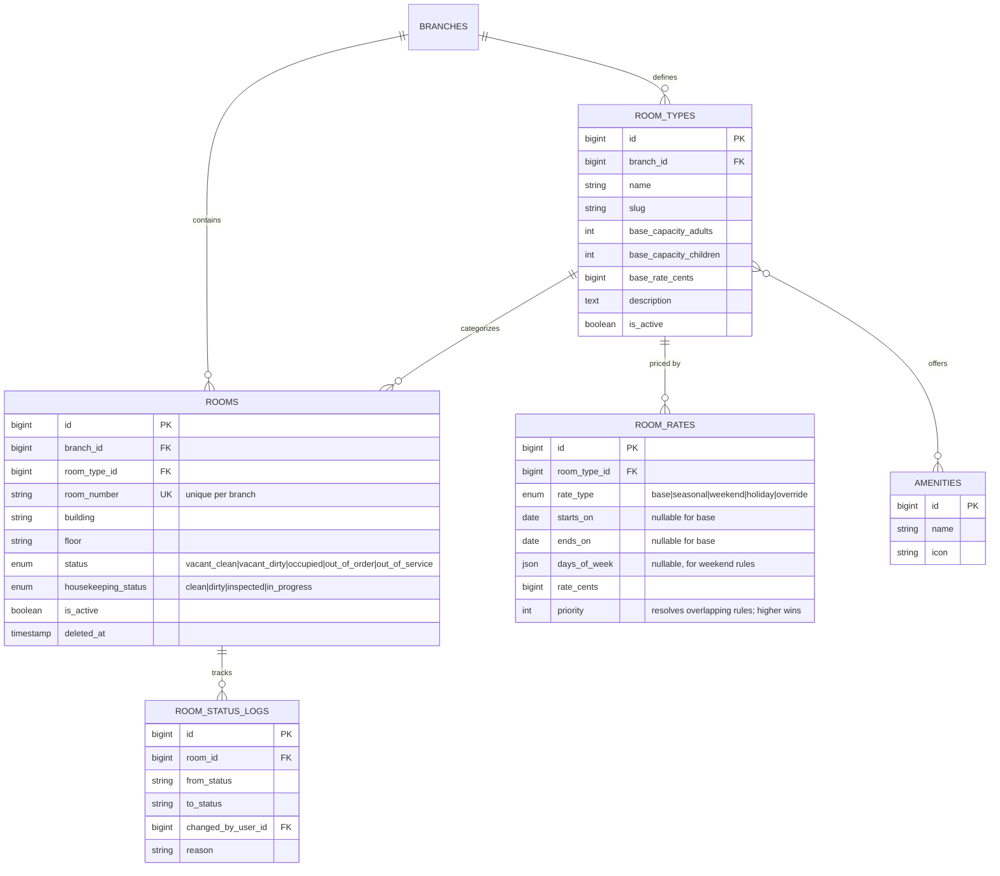

Room images use Spatie MediaLibrary's `media` table against the `ROOMS` and `ROOM_TYPES` models (collection `room-images`) rather than a bespoke table.

## 3. Guest Management

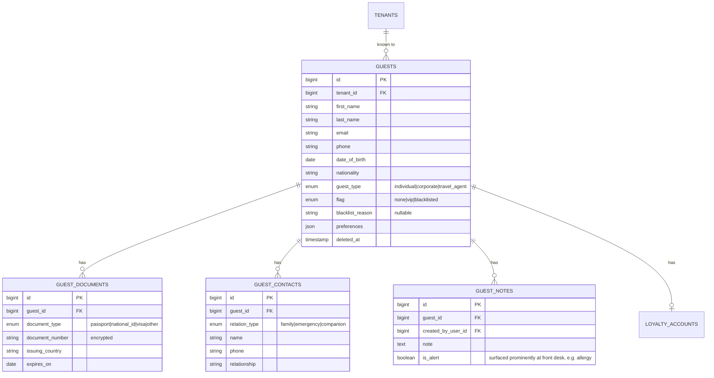

Guest document numbers use Laravel's `encrypted` cast (NFR-SEC-006); the `GUEST_DOCUMENTS` table itself is additionally covered by the media-retention scheduled purge described in the architecture doc where a scanned copy is attached via MediaLibrary (`guest-documents` collection).

## 4. Reservation Management

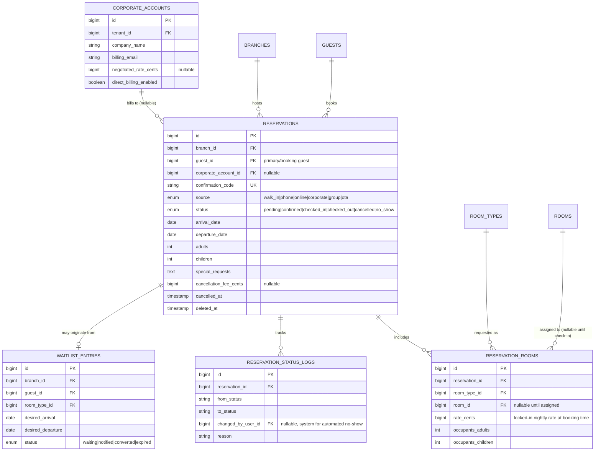

A unique partial constraint (enforced at the application/service layer via a locking query, documented in `system-architecture.md` §3 NFR-PERF-002) prevents two `RESERVATION_ROOMS` from double-booking the same `room_id` over an overlapping date range once a physical room is assigned.

## 5. Front Desk & Folio (Billing)

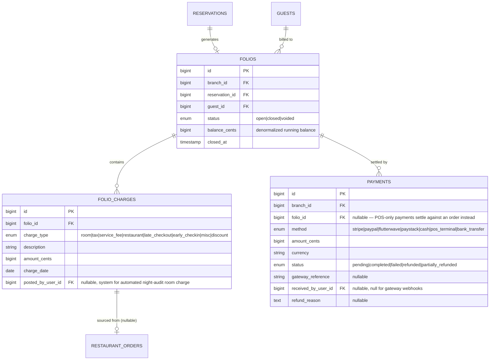

Room-upgrade/transfer (FR-FD-004) is modeled as: update the relevant `RESERVATION_ROOMS.room_id`, log a `ROOM_STATUS_LOGS` entry for both rooms, and post an offsetting `FOLIO_CHARGES` pair (credit old rate, charge new rate) rather than a bespoke "transfer" table — this keeps the folio the single source of truth for what the guest owes.

## 6. Housekeeping & Maintenance

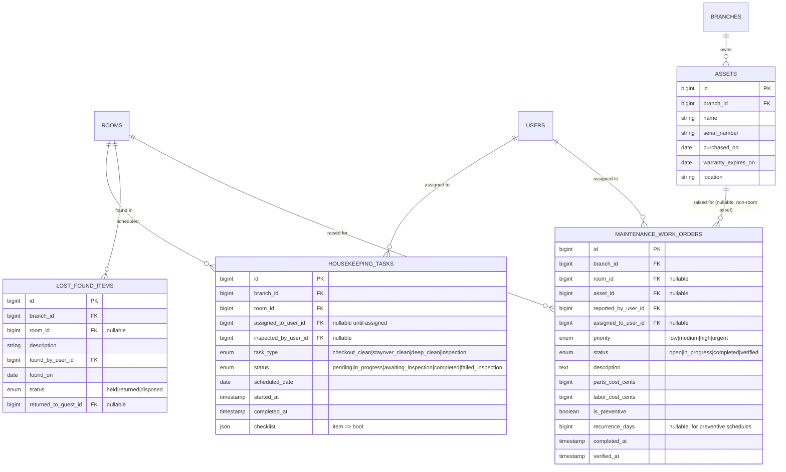

A room with an open `MAINTENANCE_WORK_ORDERS` row flagged `is_blocking = true` (derived from priority, not a stored column) is excluded from availability by the Reservation module's availability query (FR-MAINT-005) — implemented as a scope joining this table, not a denormalized flag on `ROOMS`, so the two never drift out of sync.

## 7. Restaurant & POS

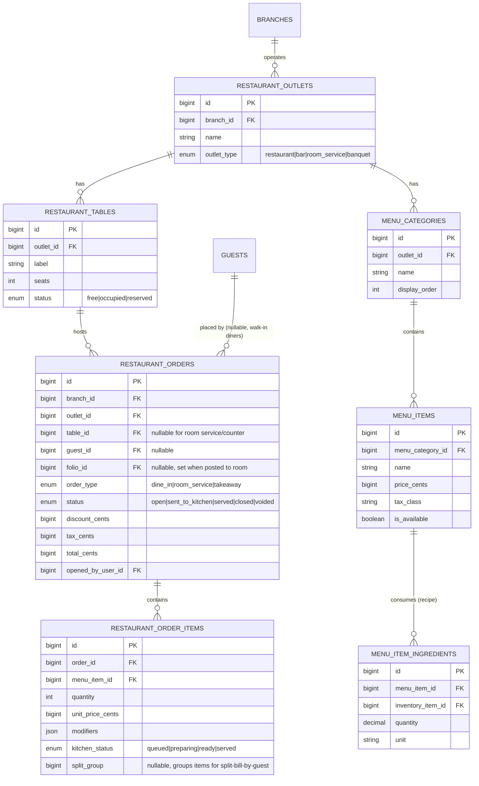

Completing a `RESTAURANT_ORDER_ITEMS` line (`kitchen_status = served` and the order closes) dispatches an event consumed by the Inventory module to deduct `MENU_ITEM_INGREDIENTS.quantity × RESTAURANT_ORDER_ITEMS.quantity` from stock (FR-POS-006) — inventory is never decremented directly by POS code.

## 8. Inventory & Procurement

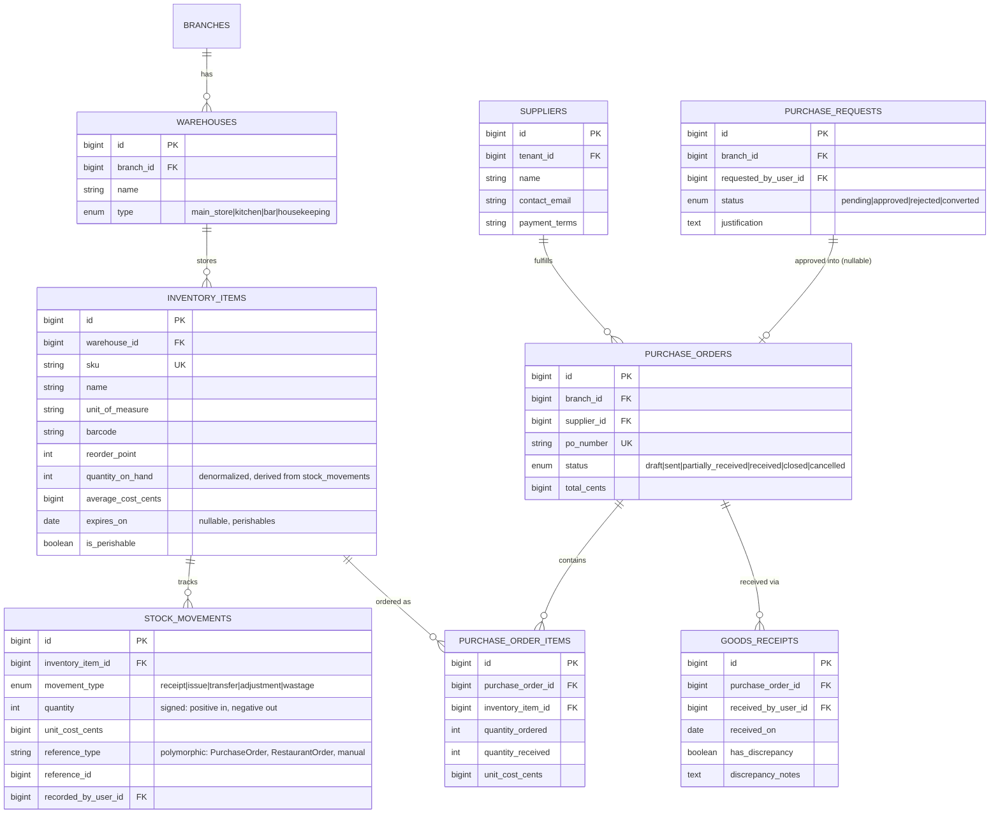

Inventory valuation (FR-INV-005) is computed from `STOCK_MOVEMENTS` using weighted-average cost, recalculated incrementally on each `receipt` movement and stored denormalized on `INVENTORY_ITEMS.average_cost_cents` for fast reads — `STOCK_MOVEMENTS` remains the append-only source of truth.

## 9. Accounting

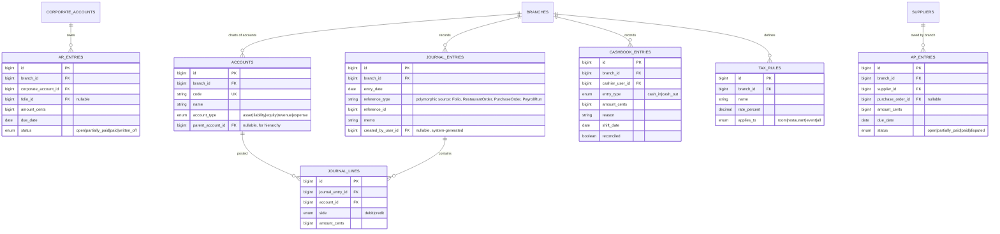

Journal entries always balance (`SUM(debit) = SUM(credit)` per `journal_entry_id`), enforced at the Action layer (`PostJournalEntryAction`) rather than a DB constraint, since MySQL cannot express a cross-row balance check declaratively — this is covered by a dedicated Unit test per `coding-standards.md`'s testing section.

## 10. Human Resources

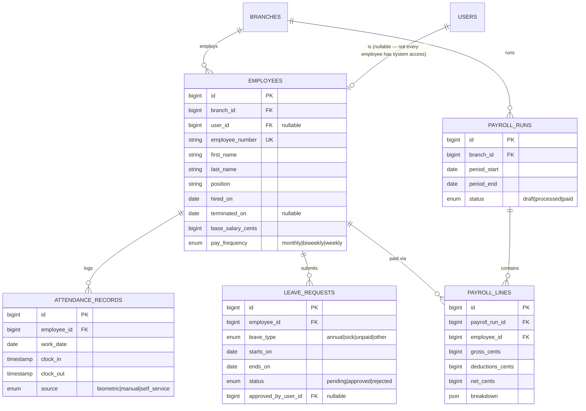

## 11. CRM, Loyalty & Events

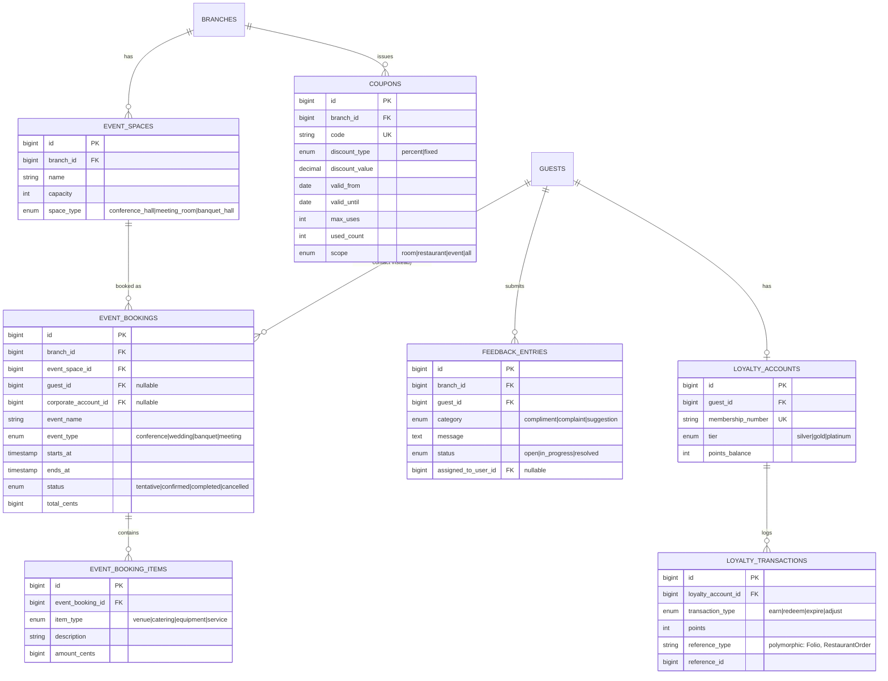

## 12. Cross-Cutting: Audit & Media

Handled entirely by first-party packages, not bespoke tables:

- **`activity_log`** (Spatie `laravel-activitylog`) — every model that implements `LogsActivity` (all financially/identity-sensitive models per NFR-SEC-005: `RESERVATIONS`, `FOLIOS`, `PAYMENTS`, `GUEST_DOCUMENTS`, `JOURNAL_ENTRIES`, role/permission changes) logs create/update/delete with a diff, the causer, and a batch UUID for grouping multi-model operations.
- **`media`** (Spatie `laravel-medialibrary`) — polymorphic attachment for `room-images`, `guest-documents`, `branch-assets`, `lost-found` collections (§9 of the architecture doc).

## 13. Indexing Notes

Beyond FK indexes (automatic with `constrained()`), the following composite indexes are required from the first migration that creates each table, since these are the queries the dashboard and availability engine run continuously:

- `rooms (branch_id, status)` — room-status board.
- `reservation_rooms (room_id, room_type_id)` plus a query-level date-range check against `reservations (arrival_date, departure_date)` — availability search.
- `reservations (branch_id, status, arrival_date)` — arrivals/departures board.
- `folios (branch_id, status)` — outstanding invoices dashboard tile.
- `stock_movements (inventory_item_id, created_at)` — running balance / valuation queries.
- `activity_log (subject_type, subject_id)` — already indexed by the package; verified, not re-implemented.
