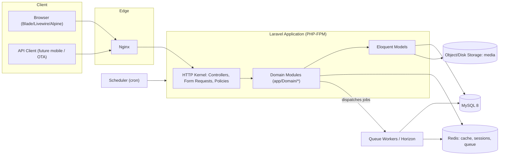
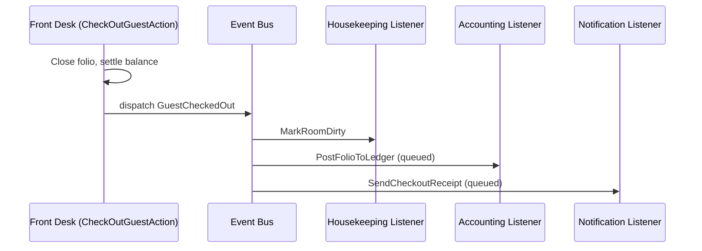

# System Architecture & Module Design

Companion to [`docs/SRS.md`](../SRS.md) and [`coding-standards.md`](coding-standards.md). This document describes *how* the system is built; the SRS describes *what* it must do.

## 1. Architectural Style

HMS is a **modular monolith**, not a microservices system: one Laravel codebase, one deployment unit, one primary database — internally partitioned into bounded-context modules that communicate through well-defined interfaces (events, contracts) rather than direct cross-module Eloquent queries wherever practical.

**Why a modular monolith and not microservices:** at the target scale (a hotel group with a handful to a few dozen branches, not thousands of independent tenants), a monolith gives transactional integrity across modules that constantly touch each other in one business event (e.g., check-out simultaneously closes a folio, posts to the GL, and frees a room for housekeeping) without distributed-transaction complexity, while still keeping the codebase navigable through strict module boundaries. If a specific module (e.g., Reporting, or a future channel-manager integration) later needs independent scaling, its module boundary is already the seam to extract it.

## 2. Module Map

Each SRS module family (§3 of the SRS) maps to a namespace under `app/Domain/<Module>`, per `coding-standards.md`. Modules are not permitted to reach into another module's Actions/Repositories directly for a *write*; cross-module effects are triggered via **domain events** (see §5). Reads of another module's data go through that module's query objects/scopes on the shared models — a full read-side segregation (CQRS) is not justified at this scale.

| Module | Depends on (reads) | Emits events consumed by |
|---|---|---|
| Tenancy/Branch | — | all modules (branch scoping) |
| Auth/Authz | Tenancy | Audit |
| Room | Tenancy | Reservation, Housekeeping, Maintenance |
| Guest | Tenancy | Reservation, CRM, Front Desk |
| Reservation | Room, Guest | Front Desk, Housekeeping (pre-arrival), Notifications |
| Front Desk | Reservation, Room, Guest | Housekeeping (room dirty), Accounting (folio → GL), Notifications |
| Housekeeping | Room | Maintenance (raise work order), Front Desk (room ready) |
| Maintenance | Room | Room (status: out of order) |
| Restaurant/POS | Guest (optional), Front Desk (room charge), Inventory | Inventory (deduction), Accounting |
| Inventory | Tenancy | Procurement (low stock) |
| Procurement | Inventory | Inventory (goods receipt), Accounting (AP) |
| Accounting | all revenue/expense-producing modules | Reporting |
| HR | Tenancy | Accounting (payroll → GL) |
| CRM/Loyalty | Guest, Front Desk, Restaurant | Notifications |
| Events | Tenancy, Guest | Accounting |
| Reporting | all modules (read-only) | — |
| Notifications | all modules (consumer only) | — |

## 3. Multi-Branch / Tenancy Strategy

**Decision: single database, shared schema, row-level scoping** — not database-per-tenant. Every branch-owned table carries a `branch_id` foreign key; every branch belongs to one `tenant_id` (the hotel group). This is enforced at three layers, not one, per NFR-SEC-008 (never rely on a single control):

1. **Global scope** — a `BelongsToBranch` trait applies a global Eloquent scope filtering by the authenticated user's currently-active branch (or all branches they're permitted to see, for group-level roles).
2. **Policy layer** — every Policy's `view`/`update`/`delete` methods independently re-check `$user->canAccessBranch($model->branch_id)` rather than trusting the query scope alone (defense in depth: a raw query, a queued job running outside request context, or a bug in the scope must not silently leak cross-branch data).
3. **Route/session context** — the active branch is resolved from the authenticated user's session (`current_branch_id`) for staff who work one branch at a time, or an explicit branch selector for group-level roles/reports.

**Why not database-per-tenant:** it would complicate cross-branch group reporting (FR-BR-004), migrations, and connection pooling for a scale where a shared schema with proper indexing on `(branch_id, ...)` performs fine. This decision should be revisited if a future customer requires strict data-residency isolation per branch — the `branch_id` column boundary is the seam for that migration path.

**Staff branch assignment & per-branch role:** implemented via an explicit `branch_user` pivot table (`branch_id`, `user_id`, `role_id` via Spatie `roles.id`, `is_primary`), rather than Spatie's built-in "teams" feature. This was chosen over `teams` for transparency and simplicity: it keeps role assignment fully visible in application code/queries (`$user->branchAssignments`) instead of behind a package-level implicit team-context switch, at the cost of the app (not the package) being responsible for "what branch is currently active" — which the app needs to track explicitly anyway for the branch-selector UX. Group-level roles (Super Administrator, Hotel Owner, General Manager, Auditor) are assigned directly to the user with no branch scoping and implicitly pass the branch-access check for every branch in their tenant.

## 4. Authentication & Authorization Architecture

- **Web:** Laravel's session-based auth (Breeze-style, hand-built to match FR-AUTH-* exactly rather than scaffolding a starter kit that would need to be substantially rewritten) — login, registration (staff created by admin, guests self-register), email verification, password reset, "remember me", account lockout, password history/expiry.
- **API:** Laravel Sanctum personal access tokens with **abilities** (scopes) matching the permission being exercised, so a token can be issued with a reduced capability set (e.g., a read-only reporting integration token).
- **MFA:** TOTP-based, optional per user, enforceable per role via a `requires_mfa` flag resolved from the user's roles at login; verified via a dedicated `MfaChallenge` step in the login pipeline (a middleware-gated intermediate auth state, not a second unauthenticated request).
- **RBAC:** Spatie `laravel-permission` for the role → permissions graph (global, not team-scoped — see §3). Every controller action/Livewire component authorizes via a Policy or `Gate::authorize`, never by hiding UI alone (NFR-SEC-008).
- **Session security:** sessions stored in Redis; "log out everywhere" invalidates all of a user's session keys; failed-login counters and lockout state stored per-account (DB) and per-IP (Redis, via Laravel's rate limiter) independently, per FR-AUTH-006.

## 5. Cross-Module Integration: Events & Listeners

Domain events are the primary mechanism for one module to react to another without a compile-time dependency. Example chain for check-out:

Events that trigger non-critical side effects (notifications, ledger posting, report cache invalidation) are handled by **queued listeners**; events whose side effect must be visible immediately in the same response (e.g., marking the room dirty so the front-desk board is correct right away) use **sync listeners**. This split is a per-listener decision documented in the listener's class docblock, not a blanket rule.

## 6. Caching Strategy

- Redis is the cache store for all environments beyond local dev convenience.
- Read-heavy, write-light aggregates (dashboard KPIs, room availability calendar for a date range) are cached with a short TTL (60–300s) plus explicit invalidation on the write paths that affect them (new reservation, check-in/out, room status change) via cache tags scoped per branch (`branch:{id}:availability`).
- Permission/role lookups are cached per Spatie's built-in caching (invalidated automatically on role/permission changes).
- Full-page caching is not used; the system is dashboard/data-driven, not content-driven.

## 7. Background Processing

| Job class of work | Mechanism |
|---|---|
| Transactional emails/SMS/WhatsApp | Queued Notification (`ShouldQueue`) |
| No-show sweep, preventive maintenance generation, seasonal rate application | Scheduled command (`routes/console.php` schedule), queued |
| Report generation/export (PDF/Excel for large ranges) | Queued job, result stored to disk + notification on completion |
| Payroll run | Queued job (batched per employee), idempotent per pay period |
| Loyalty point recalculation | Queued listener on qualifying-spend events |

Horizon supervises all queue workers in production/staging; local Windows development uses `queue:work` directly since Horizon requires POSIX extensions unavailable outside the Linux container (see `README.md`).

## 8. API Architecture

- `routes/api.php`, versioned under `/api/v1`. A breaking change to a resource's shape ships as `/api/v2` alongside `v1` for a deprecation window, never as an in-place breaking change.
- Every endpoint: Form Request for input validation + authorization, a Policy/Gate check, an Action/Service call, an API Resource for output. Controllers contain no business logic.
- Consistent error envelope: `{"message": string, "errors"?: object}` for 4xx, matching Laravel's default validation exception shape so client tooling doesn't need two parsers.
- Sanctum token abilities gate endpoint access; `throttle:api` (and stricter limits on auth endpoints) enforced per NFR-SEC-004.
- OpenAPI/Swagger spec generated from route + Form Request + Resource definitions (tooling introduced alongside the API deliverable, so the spec cannot drift from the implementation).

## 9. File & Media Storage

Spatie MediaLibrary, with distinct **collections** per use case so access control and retention rules can differ:

| Collection | Examples | Disk | Access |
|---|---|---|---|
| `room-images` | Room/room-type photos | `public` (local) / S3 public bucket (prod) | Public |
| `guest-documents` | Passport/ID/visa scans | `private` local / S3 private bucket (prod) | Permission-gated signed URL only |
| `branch-assets` | Branch logo | `public` | Public |
| `lost-found` | Lost & found photos | `private` | Staff-only |

Guest-document retention follows the branch's configured retention policy (SRS §7); a scheduled job purges media past its retention window.

## 10. Deployment Architecture

See `docker-compose.yml` / `docker/`. Containers: `nginx` (edge), `app` (PHP-FPM), `queue` (worker), `horizon` (supervisor, Linux-only), `scheduler` (cron loop), `mysql`, `redis`. All application containers share one image (`hms-app:local`/tagged in CI) built from `docker/php/Dockerfile`; only the `command`/`entrypoint` differs per role, keeping build artifacts identical between web and worker processes.

## 11. Security Architecture Summary

Maps SRS §4.2 (`NFR-SEC-*`) to concrete mechanisms:

| Requirement | Mechanism |
|---|---|
| XSS | Blade's default output escaping; CSP header via `docker/nginx/default.conf` and an app-level security-headers middleware |
| CSRF | Laravel's `VerifyCsrfToken` middleware on all web routes; API uses token auth, exempt by design |
| SQL injection | Eloquent/query builder only; `phpstan`/code review reject raw interpolated SQL |
| Mass assignment | Explicit `$fillable` per model; Form Requests are the only source of `validated()` data passed to writes |
| Audit trail | Spatie `activitylog` on all financially/identity-sensitive models, `LogsActivity` trait |
| Encryption at rest | Laravel encrypted casts on ID document numbers; DB-level encryption is an infra-layer concern (managed MySQL) documented in the deployment guide |
| Rate limiting | Laravel rate limiter on auth + all API routes |

## 12. Open Architectural Decisions Requiring Revisit

- Real-time in-app notifications (FR-NOTIF-003) need a broadcasting driver (Reverb vs. Pusher) — deferred until the Notifications module is implemented; the abstraction (Laravel Notification channels) does not require this choice now.
- Channel-manager/OTA sync is explicitly out of scope for v1 (SRS §1.2) but the Reservation module's availability engine is designed so an OTA adapter would be an additional consumer of the same availability service, not a rewrite.
